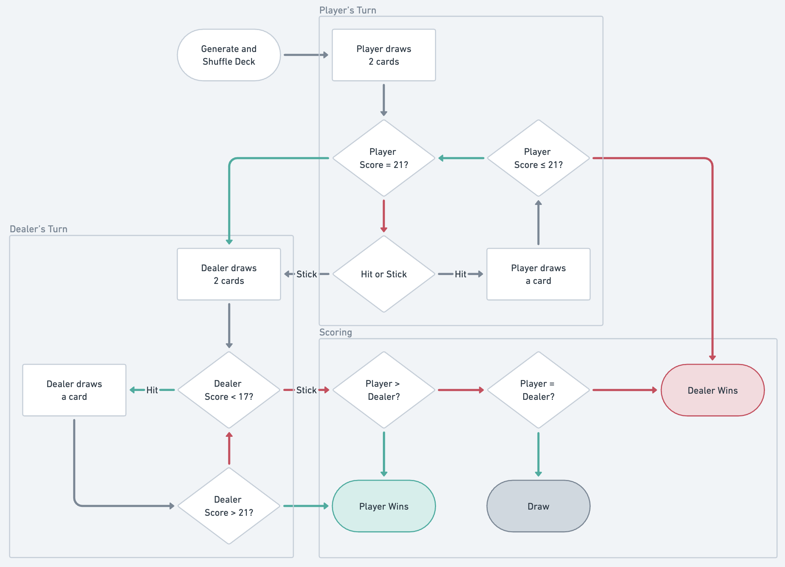

# Blackjack



## Project Specification

- Generate a deck of cards
- Randomise a deck of cards
- Play a full game, taking input from a user
- Simulate a Dealers turn
- Decide who has won the game

```
Seed: 1597918069443
Your hand is 7S, AC
(18 points)
? What do you want to do? ("hit" or "stick") stick
stick
Sticking
Dealer's hand is 3H, 4D
(7 points)
Dealer draws 8C
Dealer's hand is 3H, 4D, 8C
(15 points)
Dealer draws 5S
Dealer's hand is 3H, 4D, 8C, 5S
(20 points)
You lose!
```

## The Game

We're creating a simple blackjack game that we can play from our terminal. We're going to be using the rules from a variant of blackjack called French/German Blackjack which is slightly simpler than normal blackjack.

In French/German blackjack, each card is worth a certain number of points:

| Rank | Points |
| --- | --- |
| A |	11 |
| 2 |	2 |
| 3 |	3 |
| 4 |	4 |
| 5 |	5 |
| 6 |	6 |
| 7 |	7 |
| 8 |	8 |
| 9 |	9 |
| 10 | 10 |
| J |	10 |
| Q |	10 |
| K |	10 |

The Player's goal is to get as close to 21 as possible without going over. Usually the number of points in your hand is very easy to calculate. Let's say we start with a hand of A♠️ and 5♦️. Checking the table above, we have A = 11 and 5 = 5 (of course), so our hand is worth 16.

We can choose to draw another card ("hit") or take our chances that the Dealer won't beat 16 points without going over 21 ("stick"). Let's say we hit and draw a Q♥️. Our hand is now worth 11 + 5 + 10 = 26 points: we went over 21 and we lose the round.

There are two cases special cases for calculating points. If our first two cards are two aces, our hand is worth 21 points (rather than 22 points as you'd expect). Also, if we have a hand with 6 or more cards that's worth less than 21 points we round it up to 21. So, for example, 5♣️, 2♠️, 3♦️, 4♣️, 2♣️, 3♠️ would be worth 21 points rather than 19. Both of these special cases are quite rare!

## Order of Play

Our game of blackjack proceeds like so:

1. The Player is dealt the top two cards from the deck.
2. If the Player already has 21 (a "natural" blackjack), go to step 4.
3. The Player's turn. The Player has the option to either "hit" or "stick". If they "hit" they draw another card. If this new card takes them over 21, go to step 5. A Player can "hit" as many times as they want. When a Player opts to "stick", proceed to step 4.
4. The Dealer's turn: see the next section.
5. Deciding a winner: if the Player went over 21, the Dealer wins (without the Dealer taking a turn). If the Player stayed under 21, but the Dealer went over 21, the Player wins. If both participants stayed under 21, the participant with most points wins - if both the Player and Dealer have the same number of points, the game is a draw.

## The Dealer's moves

In blackjack the Player chooses their strategy, but the Dealer has to play according to a simple rule. If their hand is worth less than 17 points, they "hit" (draw another card). Otherwise they "stick" and end their turn. It's that simple!